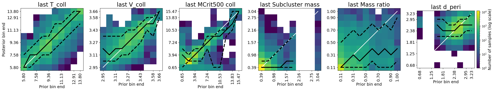

# CINN\_spline: Scalar Submodule

This submodule implements the **scalar** pipeline of the Conditional Invertible Neural Network (cINN) framework for modeling galaxy cluster merger properties. It covers:

1. **Data preprocessing** (`data_filter.py`)
2. **Data loading** (`data_loader.py`)
3. **Model definition** (`model.py`)
4. **Training loop** (`trainer.py`, `main.py`)
5. **Plotting utilities** (`plot_utils.py` and notebook scripts)

---

## Table of Contents

* [Installation](#installation)
* [Directory Structure](#directory-structure)
* [Usage](#usage)

  * [1. Data Preprocessing](#1-data-preprocessing)
  * [2. Creating DataLoaders](#2-creating-dataloaders)
  * [3. Model Architecture](#3-model-architecture)
  * [4. Training](#4-training)
  * [5. Plotting Results](#5-plotting-results)

---

## Installation

1. **Clone the repository**

   ```bash
   git clone <repo_url>
   cd CINN_spline/scalar
   ```

2. **Create & activate a Python environment** (recommended)

   ```bash
   python3 -m venv venv
   source venv/bin/activate
   ```

3. **Install dependencies**

   ```bash
   pip install -r requirements.txt
   ```

*Required libraries include:* `numpy`, `pandas`, `scikit-learn`, `torch`, `FrEIA`, `matplotlib`, `scipy`, `joblib`, `pyyaml`.

---

## Directory Structure

```text
scalar/
├── data_filter.py              # Preprocess raw CSVs into scaled datasets
├── data_loader.py              # Build PyTorch DataLoaders
├── model.py                    # Defines VBLinear, Subnet, transformations, CINN
├── trainer.py                  # Training logic, logging, checkpointing
├── main.py                     # CLI entry point for training runs
├── params.yaml                 # Hyperparameter configuration
├── plot_utils.py               # Common routines for posterior sampling & KDE
├── 1.posterior_distribution.ipynb  # Notebook generating Figure 1
├── 1.posterior_distribution.png   # Posterior distribution figure
├── 2.prediction_performance.ipynb # Notebook for performance evaluation
├── 2.prediction_performance1.png  # Performance heatmap (prior vs posterior)
├── 2.prediction_performance2.png  # MAP vs truth & error vs truth plots
├── 3.uncertainities.ipynb         # Notebook analyzing predictive uncertainties
├── 3.uncertainities.png           # Uncertainty vs error scatter
├── 4.cross_correlations.ipynb     # Notebook for cross-correlation analysis
├── 4.cross_correlations.png        # Cross-correlation heatmap
├── processed_data/             # Generated: scaled X.csv, Y.csv, meta.csv, scalers
└── runs/                       # Output directory for checkpoints & logs
```

---

## Usage

### 1. Data Preprocessing

Merge observables & unobservables, drop missing targets, scale features:

```bash
python data_filter.py \
  --obs_csv observables1.csv \
  --unobs_csv unobservables1.csv \
  --out_dir processed_data
```

* **Input:** `observables1.csv`, `unobservables1.csv` (must share `HaloID, Snapshot`).
* **Outputs in `processed_data/`:**

  * `X.csv`: scaled observables
  * `Y.csv`: scaled targets
  * `meta.csv`: `HaloID, Snapshot`
  * `obs_scaler.pkl`, `tar_scaler.pkl`

### 2. Creating DataLoaders

```python
from data_loader import get_loaders
train_loader, val_loader = get_loaders(
    processed_dir="processed_data",  
    batch_size=512,
    val_frac=0.1,
)
```

* Splits by **unique** `HaloID` to avoid leakage.
* Returns PyTorch `DataLoader` with fields `.data` (targets) and `.cond` (observables).

### 3. Model Architecture

The core of the scalar pipeline is the **cINN** defined in `model.py`. Key components:

* **`VBLinear`**: A Bayesian linear layer using the local reparameterization trick for weight uncertainty. Supports MAP inference to use only weight means at test time.
* **`Subnet`**: Constructs customizable fully-connected subnets (optionally Bayesian) that predict coupling parameters.
* **`LogTransformation`**: An invertible module applying `log(x + α)` in the forward pass and exp in the reverse, handling positive-valued data.
* **`RationalQuadraticSplineBlock`**: Implements a coupling transform using rational‐quadratic splines:

  * **Bins & heights** are learned via the subnet; tails are linear outside bounds.
  * **Monotonic and invertible** with tractable Jacobian determinants.
  * **Controls** expressivity via the number of bins (`num_bins` in `params.yaml`).
* **`CINN`**: Chains multiple blocks into a GraphINN:

  1. **InputNode** for targets
  2. **ConditionNode** for observables
  3. Alternating **coupling blocks** and **permutations**
  4. **OutputNode** yields latent variables `z`

In the forward pass: `x → z` with log‐likelihood `log p(z) + log|det J|`. In reverse: sample `z ~ N(0,I)` to generate `x` conditioned on observables.

*Important hyperparameters* in `params.yaml`: number of blocks (`n_blocks`), coupling type (`affine` or `rational_quadratic`), bins (`num_bins`), hidden sizes, Bayesian flags.

### 4. Training

Use `main.py` to kick off training:

```bash
python main.py params.yaml
```

* **`Trainer`** (in `trainer.py`) loads data, builds the model on CPU/GPU, and sets up an optimizer (AdamW) with a scheduler (`one_cycle`, `step`, or `reduce_on_plateau`).
* At each epoch:

  1. **Compute** negative log‑likelihood (`-mean log_prob`) and KL term for Bayesian layers.
  2. **Backpropagate**, clip gradients if needed, and update weights.
  3. **Evaluate** on validation set, logging train/val NLL & KL.
  4. **Checkpoint** model weights at intervals into `runs/<timestamp>_<run_name>/`.

### 5. Plotting Results

#### Generating Figures

All plotting scripts assume:

* `model.pt` exists in the runs folder and generated after runnig the training. 
* `processed_data/` contains the pre‑processed CSVs & scalers.

Run any script inside the jupyter notebook files:

```bash
1.posterior_distribution.ipynb       # Fig. 1  prior v posterior grid
2.prediction_performance.ipynb       # Fig. 2a heat‑maps, Fig. 2b truth v MAP
3.uncertainities.ipynb               # Fig. 3  calibration
4.cross_correlation.ipynb            # Fig. 4  pairwise correlations
```

Each script saves a high‑resolution PNG (and commented‑out PDF) in the repo root with intuitive file names:

```
posterior_distribution.png
2.prediction_performance1.png
2.prediction_performance2.png
3.uncertainities.png
4.cross_correlations.png
```

---

####  Figure Gallery

=======
| #  | File                           | Insight                                                                        
| -- | ------------------------------ | ------------------------------------------------------------------------------ 
| 1  | 1.posterior\_distribution.png    | Side‑by‑side prior/posterior comparison with MAP + truth per cluster.          
| 2a | 2.prediction\_performance1.png | Heat‑maps of how posteriors shift relative to prior bins across targets.       
| 2b | 2.prediction\_performance2.png | MAP accuracy & error distribution as a function of ground‑truth value.         
| 3  | 3.uncertainities.png           | Checks correlation between predicted σ and actual                              
| 4  | 4.cross\_correlations.png      | Joint distributions (truth, posterior, MAP) for every target pair.             

##### 1  Prior vs Posterior (Figure 1)


*Side‑by‑side KDE curves of the population prior (grey dashed), model posterior (blue), MAP estimate (gold), and ground truth (red) for every cluster and target.*

---

##### 2a  Posterior Heat‑maps (Figure 2a)


*2‑D heat‑maps of prior bin → posterior bin counts, overlaid with median (solid) and 10th/90th percentile (dashed) lines for each target.*

---

##### 2b  MAP & Error Trends (Figure 2b)


*Top row: Ground‑truth vs MAP predictions.  Bottom row: Absolute error vs truth (symlog scale) with 16th/84th percentile bands.*

---

##### 3  Uncertainty Calibration (Figure 3)


*Scatter of |MAP − truth| versus posterior σ, including Gaussian reference curves and binned 68th/95th percentile error lines.*

---

##### 4  Cross‑correlations (Figure 4)


*Staircase grid of pairwise scatter plots showing joint distributions of truth (red), posterior samples (light‑blue), and MAP predictions (mustard) for every target pair.*
