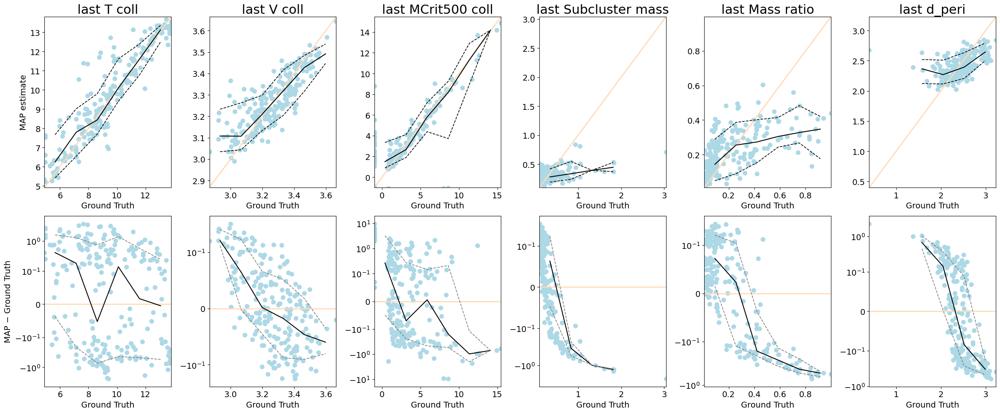
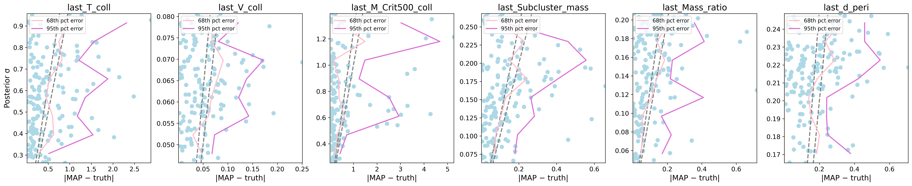

# CINN\_spline: Scalar Submodule

This repository implements two complementary pipelines under the **Conditional Invertible Neural Network (cINN)** framework for modeling galaxy cluster merger properties:

* **scalar/**: Uses tabular observational features (such as mass, radius, ..) as conditioning variables.
* **representation\_space/**: Uses deep learned representations from mock images as conditioning inputs, optionally enhanced using a **Mixture of Experts (MoE)** model.

----
1. **Data preprocessing** (`data_filter.py`)
2. **Data loading** (`data_loader.py`)
3. **Model definition** (`model.py`)
4. **Training loop** (`trainer.py`, `main.py`)
5. **Plotting utilities** (`plot_utils.py` and notebook scripts)

---

## Table of Contents

* [Installation](#installation)
* [Directory Structure](#directory-structure)
* [Usage](#usage)

  * [1. Data Preprocessing](#1-data-preprocessing)
  * [2. Model Architecture](#2-model-architecture)
  * [3. Training](#3-training)
  * [4. Plotting Results](#4-plotting-results)
  * [5. Mixture of Experts Extension](#5-mixture-of-experts-extension)
  * [6. Figure Gallery](#6-figure-gallery)


## Installation

```bash
git clone <repo_url>
cd CINN_spline
python3 -m venv cinn_venv
source cinn_venv/bin/activate
pip install -r requirements.txt
```


*Required libraries include:* `numpy`, `pandas`, `scikit-learn`, `torch`, `FrEIA`, `matplotlib`, `scipy`, `joblib`, `pyyaml`.

---

## Directory Structure

```text
CINN_spline/
├── scalar/                           # Tabular observables → cINN → merger properties pipeline
│   ├── data_filter.py               # Preprocess raw observables/unobservables into scaled datasets
│   ├── data_loader.py               # Load and split data with unique HaloID-based splitting
│   ├── model.py                     # Defines cINN architecture (VBLinear, coupling layers, splines)
│   ├── trainer.py                   # Training loop with optimizer, NLL loss, and logging
│   ├── main.py                      # CLI entry point for launching training runs
│   ├── params.yaml                  # Configuration of model, training, data parameters
│   ├── plot_utils.py                # Shared tools for KDE, posterior sampling, and MAP computation
│   ├── 1.posterior_distribution.ipynb # Notebook for visualizing prior vs posterior comparison
│   ├── 1.posterior_distribution.png   # Output of notebook: KDE curves for all targets
│   ├── 2.prediction_performance.ipynb # Notebook for heatmaps, MAP predictions vs truth
│   ├── 2.prediction_performance1.png  # Heatmap plot: prior bin → posterior bin
│   ├── 2.prediction_performance2.png  # Scatter plot: MAP vs truth, and error vs truth
│   ├── 3.uncertainities.ipynb         # Notebook for uncertainty calibration (error vs std)
│   ├── 3.uncertainities.png           # Scatter of |MAP−truth| vs σ with calibration lines
│   ├── 4.cross_correlations.ipynb     # Notebook for pairwise posterior correlations
│   ├── 4.cross_correlations.png       # Staircase scatter plot of MAP/posterior/truth
│   ├── processed_data/             # Preprocessed scaled CSVs, scalers, metadata
│   └── runs/                       # Model checkpoints and logs per training run
│
├── representation_space/          # CNN embeddings → MoE (expert cINNs) → target prediction
│   ├── cluster_setup.py            # Applies KMeans clustering on embeddings & prepares labels
│   ├── train_experts.py            # Trains a separate cINN model for each expert cluster
│   ├── data_loader.py              # Loads expert-specific subsets based on cluster label
│   ├── model.py                    # Expert model architecture: cINN with spline couplings
│   ├── trainer.py                  # Modular expert training logic and checkpointing
│   ├── plot_utils.py               # Utilities for shared MAP/posterior/std analysis
│   ├── 1.posterior_distribution.ipynb # Prior vs posterior comparison for expert predictions
│   ├── 1.posterior_distribution.png   # Figure 1: Expert posterior density per target
│   ├── 2.prediction_performance.ipynb # MAP and performance visualizations
│   ├── 2.prediction_performance1.png  # Heatmap (prior vs posterior bins)
│   ├── 2.prediction_performance2.png  # MAP scatter and error vs ground truth
│   ├── 3.uncertainities.ipynb         # Posterior std vs |MAP − truth| plots
│   ├── 3.uncertainities.png           # Uncertainty calibration curve (MoE setup)
│   └── experts/                    # Folder of expert_id/ subdirs, each with model.pt
│       └── <expert_id>/           # Trained weights for each expert cINN
│
└── README.md                    
```


---

Here is the improved and corrected **Usage** section for your `README.md`, incorporating your feedback:

---

## Usage

### 1. Scalar Submodule

**Preprocessing:**
Merge observables & unobservables, drop missing targets, scale features:

```bash
python scalar/data_filter.py \
  --obs_csv observables1.csv \
  --unobs_csv unobservables1.csv \
  --out_dir scalar/processed_data
```

* **Input:** `observables1.csv`, `unobservables1.csv` (must share `HaloID, Snapshot`)
* **Outputs (in `scalar/processed_data/`):**

  * `X.csv`: scaled observables
  * `Y.csv`: scaled targets
  * `meta.csv`: `HaloID, Snapshot`
  * `obs_scaler.pkl`, `tar_scaler.pkl`

Splits are made by **unique** `HaloID` to avoid data leakage across train/val/test.
Returns PyTorch `DataLoader` with `.data` (targets) and `.cond` (observables).

**Training:**

```bash
python scalar/main.py scalar/params.yaml
```

This runs the standard cINN model **without** the Mixture of Experts (MoE) component.

**Visualization:**
Run any of the following notebooks inside `scalar/` to generate figures:

* `1.posterior_distribution.ipynb`
* `2.prediction_performance.ipynb`
* `3.uncertainities.ipynb`
* `4.cross_correlations.ipynb`

---

### 2. Representation Space Submodule

**Preprocessing:**
To apply the MoE model to a set of **image embeddings**:

```bash
python representation_space/cluster_data_filter_simple.py \
  --embeddings embeddings.npy \
  --filenames filenames.npy \
  --features_csv cluster_features.csv \
  --output_dir representation_space/processed_data
```

**Setup for Expert Clustering:**
Before training the experts, you need to cluster the samples:

```bash
python representation_space/cluster_setup.py \
  --processed_dir representation_space/processed_data \
  --params_path representation_space/params.yaml
```

This generates clustering assignments for the mixture components and updates the `params.yaml` accordingly.

**Training Experts (MoE):**
This will launch one cINN per expert using the cluster assignments:

```bash
python representation_space/train_experts.py \
  --params_path representation_space/params.yaml \
  --save_dir representation_space/experts/
```

🧠 **Note:** `train_experts.py` enables the **Mixture of Experts** (MoE) approach, which has been empirically shown to **significantly improve prediction quality** over the single-network baseline (`main.py`).

**Visualization:**
Notebooks in `representation_space/` follow the same API as in `scalar/`:

* `1.posterior_distribution.ipynb`
* `2.prediction_performance.ipynb`
* `3.uncertainities.ipynb`

Each will automatically load expert checkpoints and produce the corresponding plots.

---

Let me know if you'd like to link the figures side-by-side as a gallery or if you'd like a version with collapsible code blocks for cleaner GitHub rendering.


### Model Architecture

The core of the scalar pipeline is the **cINN** defined in `model.py`. Key components:

* **`VBLinear`**: A Bayesian linear layer using the local reparameterization trick for weight uncertainty. Supports MAP inference to use only weight means at test time.
* **`Subnet`**: Constructs customizable fully-connected subnets (optionally Bayesian) that predict coupling parameters.
* **`LogTransformation`**: An invertible module applying `log(x + α)` in the forward pass and exp in the reverse, handling positive-valued data.
* **`RationalQuadraticSplineBlock`**: Implements a coupling transform using rational‐quadratic splines:

  * **Bins & heights** are learned via the subnet; tails are linear outside bounds.
  * **Monotonic and invertible** with tractable Jacobian determinants.
  * **Controls** expressivity via the number of bins (`num_bins` in `params.yaml`).
* **`CINN`**: Chains multiple blocks into a GraphINN:

  1. **InputNode** for targets
  2. **ConditionNode** for observables
  3. Alternating **coupling blocks** and **permutations**
  4. **OutputNode** yields latent variables `z`

In the forward pass: `x → z` with log‐likelihood `log p(z) + log|det J|`. In reverse: sample `z ~ N(0,I)` to generate `x` conditioned on observables.

*Important hyperparameters* in `params.yaml`: number of blocks (`n_blocks`), coupling type (`affine` or `rational_quadratic`), bins (`num_bins`), hidden sizes, Bayesian flags.

Use `main.py` to kick off training:

```bash
python main.py params.yaml
```

* **`Trainer`** (in `trainer.py`) loads data, builds the model on CPU/GPU, and sets up an optimizer (AdamW) with a scheduler (`one_cycle`, `step`, or `reduce_on_plateau`).
* At each epoch:

  1. **Compute** negative log‑likelihood (`-mean log_prob`) and KL term for Bayesian layers.
  2. **Backpropagate**, clip gradients if needed, and update weights.
  3. **Evaluate** on validation set, logging train/val NLL & KL.
  4. **Checkpoint** model weights at intervals into `runs/<timestamp>_<run_name>/`.

#### Mixture of Experts (MoE):

In `representation_space/`, the dataset is clustered (e.g., k-means) and a separate cINN expert is trained per cluster. At inference:

* A datapoint is assigned to its expert (based on nearest cluster center).
* The assigned expert generates posterior samples.

This improves generalization when conditioning embeddings are heterogeneous.

### Plotting Results

#### Generating Figures

All plotting scripts assume:

Run any script inside the jupyter notebook files:

```bash
1.posterior_distribution.ipynb       # Fig. 1  prior v posterior grid
2.prediction_performance.ipynb       # Fig. 2a heat‑maps, Fig. 2b truth v MAP
3.uncertainities.ipynb               # Fig. 3  calibration
4.cross_correlation.ipynb            # Fig. 4  pairwise correlations 
```

Each script saves a high‑resolution PNG (and commented‑out PDF) in the repo root with intuitive file names:

```
posterior_distribution.png
2.prediction_performance1.png
2.prediction_performance2.png
3.uncertainities.png
4.cross_correlations.png
```

---

##  Figure Gallery

### Scalar Submodule

##### 1  Prior vs Posterior (Figure 1)


*Side‑by‑side KDE curves of the population prior (grey dashed), model posterior (blue), MAP estimate (gold), and ground truth (red) for every cluster and target.*

---

##### 2a  Posterior Heat‑maps (Figure 2a)


*2‑D heat‑maps of prior bin → posterior bin counts, overlaid with median (solid) and 10th/90th percentile (dashed) lines for each target.*

---

##### 2b  MAP & Error Trends (Figure 2b)


*Top row: Ground‑truth vs MAP predictions.  Bottom row: Absolute error vs truth (symlog scale) with 16th/84th percentile bands.*

---

##### 3  Uncertainty Calibration (Figure 3)


*Scatter of |MAP − truth| versus posterior σ, including Gaussian reference curves and binned 68th/95th percentile error lines.*

---

##### 4  Cross‑correlations (Figure 4)


*Staircase grid of pairwise scatter plots showing joint distributions of truth (red), posterior samples (light‑blue), and MAP predictions (mustard) for every target pair.*

### Representation Space Submodule

#### 1. Prior vs Posterior (Figure 1)


*Same as scalar version, applied to embedding-based conditioning.*

#### 2a. Posterior Heatmaps (Figure 2a)


*Same as scalar but under MoE-based embeddings.*

#### 2b. MAP & Error Trends (Figure 2b)


*Trends under expert-level predictions.*

#### 3. Uncertainty Calibration (Figure 3)


*MoE-enhanced prediction uncertainty vs truth comparison.*
